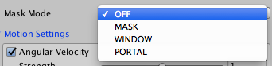
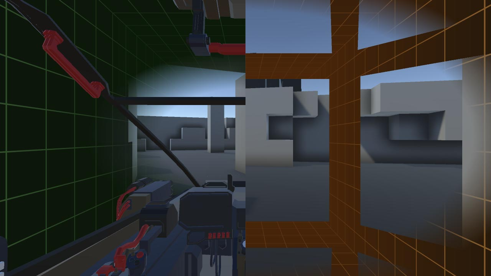
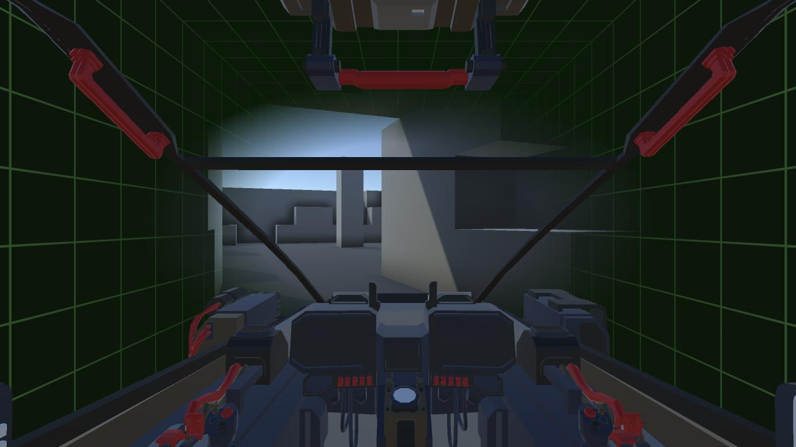
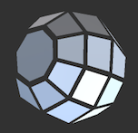
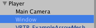
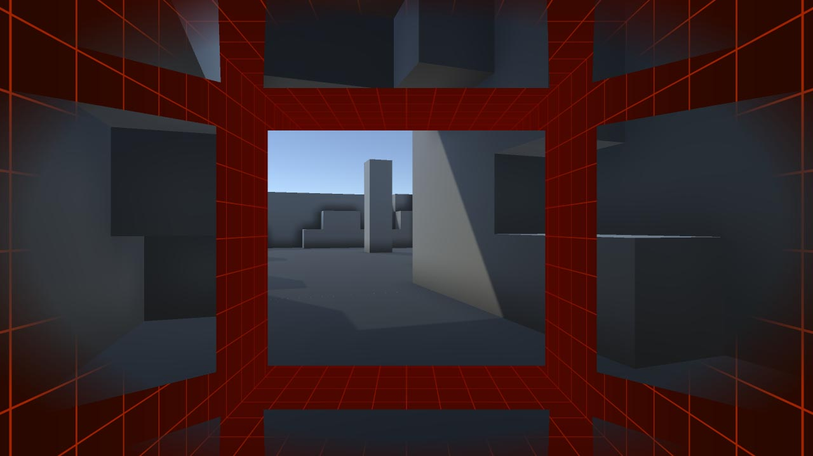
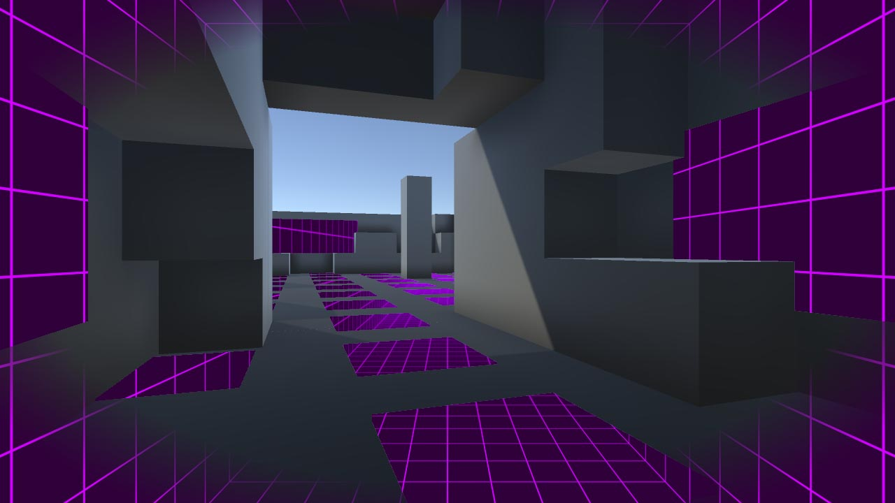

\page mask Masking
Masking allows control of where the effect appears on screen. The primary use is to exclude certain objects from the effect (see \ref mmask "MASK Mode"), but it can also be used to provide areas of the effect which appear regardless of motion. These areas can be relative to the user (see \ref mwindow "WINDOW Mode") or in world-space (see \ref mportal "PORTAL Mode").

> **TIP:** **WINDOW** mode creates the effect described in [this Oculus blog post](https://developer.oculus.com/blog/research-into-comfortable-locomotion/) under the heading *Window Into the Moving World*, while **PORTAL** mode creates the effect under the heading *Portals Into the Static World*.

To ignore transparent and UI elements, consider using **TunnellingOpaque** instead of **Tunnelling** - this draws the effect after opaque geometry rather than at the end of the frame. See the \ref man "manual home page" for more details.

> **TIP:** All **Mask Modes** can be used with all \ref bkg "Background Modes" - for example, \ref mmask "MASK" with \ref mblur "BLUR" will blur everything in the periphery except masked objects.

## Mask Objects
Regardless of **Mask Mode** there are two ways to mask an object. 

    
    Tunnelling Mask Object script. 
    Ticking Auto Add Children will mask both the arrow and the cube.

The simplest is to add a **TunnellingMaskObject** script\ref Sigtrap.VrTunnellingPro.TunnellingMaskObject "[API]" to any object to be masked. The object must have a **Renderer** component, such as a **MeshRenderer**. Ticking **Auto Add Children** will include child **Renderer** objects in the mask. Disabling the component or the gameobject will stop it being masked, and re-enabling will again add it to the mask.

Objects can also be masked from code using the \ref Sigtrap.VrTunnellingPro.Tunnelling.AddObjectToMask "AddObjectToMask (Renderer r, bool includeChildren)" and \ref Sigtrap.VrTunnellingPro.Tunnelling.RemoveObjectFromMask "RemoveObjectFromMask (Renderer r, bool includeChildren)" methods. Alternatively, just use `gameObject.AddComponent<TunnellingMaskObject>()`.

## Modes

    
    Mask modes

> **TIP:** All **Mask Modes** except **OFF** will disable the **Iris Z Rejection** optimisation (see \ref bkg "Background Modes").

- \subpage mmask - Exclude individual objects from the effect.
- \subpage mwindow - Show the VR world through static windows.
- \subpage mportal - Show the effect through world-space portals.

> **TIP:** The mobile version cannot use **WINDOW** or **PORTAL** modes. Please see the \ref mobile "mobile manual page" for details.

    
    Left: **MASK** mode. Right: **WINDOW** mode.

\page mmask MASK Mode
Masked objects are excluded from the effect. This is particularly useful for cockpits which already provide the user a static reference frame and therefore need not be faded out. This can help some users by making the effect less distracting, since less of the world around them changes.

    
    **MASK** mode with cage and motion. The cockpit object has a **TunnellingMaskObject** script attached, and excludes the vignette.

\page mwindow WINDOW Mode

    

        
        Example window mesh included in VRTP
    

    

        
        The window mesh with **Tunnelling** 
        **Mask Object** script is a child 
        of the **Motion Transform** (Player)
    

Masked objects provide a "window" into the VR world regardless of motion. As long as \ref motion "Motion Settings" are turned on, the vignette will also fade in the cage in the user's periphery upon movement.

> **TIP:** To use in this manner, masked objects should be parented to the **Motion Transform** object so they remain static relative to the user.

This is primarily used to create windows that are static relative to the user, so the cage is seen in fixed places at all times. This can provide a constant static reference for the player regardless of motion, to reinforce the perception that the cage is the "real" world and therefore movement in the VR world is fake.

> **TIP:** This creates the effect described in [this Oculus blog post](https://developer.oculus.com/blog/research-into-comfortable-locomotion/) under the heading *Window Into the Moving World*.

This is the inverse of \ref mportal "PORTAL Mode" where masked objects show the *cage*, not the *world*.

An example window mesh, seen above, is provided in *VrTunnellingPro/Prefabs/Cages/Meshes*.

> **TIP:** **Effect Color** alpha controls opacity of the effect as usual.

    
    **WINDOW** mode with cage and motion, using the provided window mesh. The cage can be seen between the "panels" of the window mesh. The vignette fades in at the periphery due to the motion settings.

\page mportal PORTAL Mode
Masked objects provide a "portal" into the cage regardless of motion. As long as \ref motion "Motion Settings" are turned on, the vignette will also fade in the cage in the user's periphery upon movement.

> **TIP:** To use in this manner, masked objects should be in world space, not affected by player motion.

This is primarily used to create portals fixed in the world, so the cage is seen "through" the world. This can help the user ignore motion by establishing the cage as a constant static background.

> **TIP:** This creates the effect described in [this Oculus blog post](https://developer.oculus.com/blog/research-into-comfortable-locomotion/) under the heading *Portals Into the Static World*.

This is the inverse of \ref mwindow "WINDOW Mode" where masked objects show the *world*, not the *cage*.

> **TIP:** **Effect Color** alpha controls opacity of the *world*, not the effect. This can be used to partially overlay a cage or cubemap over the entire view.

    
    **PORTAL** mode with cage and motion. Portal objects in the scene have the **TunnellingMaskObject** script attached. The vignette fades in at the periphery due to the motion settings.

