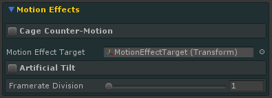
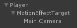
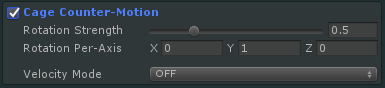
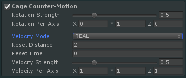
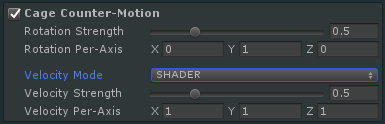
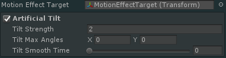
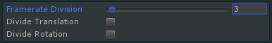

\page mfx Motion Effects

    
    The Motion Effects panel.

VRTP's Motion Effects alter the player's motion - or perceived motion - through the VR world. This can complement the tunnelling, cage and other visual effects by further reducing the sensation of motion.

> **TIP:** Motion Effect modes can be used on mobile platforms, and can be used together with each other and/or any other effects.

## Motion Effects
- \subpage mcounter
- \subpage mtilt
- \subpage mfpsdiv

For **Articial Tilt** and **Framerate Division**, the *Motion Effect Target* field must be set. This should be a child of the *Motion Target* and a parent of the camera.

    
    Suggested hierarchy for Motion Effect Target. 
	*Player* is the Motion Target.

> **TIP:** Motion Target and Motion Effect Target *must not* be the same!

\page mcounter Counter-Motion
These modes allow VRTP to generate "counter-optic flow" - fake visual motion to cancel out the player's motion through the VR world.

## Counter-Rotation
The cage and/or skybox is rotated opposite to the *Motion Target*'s rotation.

    
    Counter-rotation settings.

**Rotation Strength** scales the counter-rotation. For example, at a strength of 1, if the *Motion Target* rotates 10 degrees left, the cage/skybox will rotate 10 degrees right. At 0.5, this will be 5 degrees. Moderate strengths can be less intrusive for many players while still having a positive effect.
**Rotation Per-Axis** scales the counter-rotation strength around individual axes. This multiplies **Rotation Strength** on each axis.
- **X**: Pitch
- **Y**: Yaw
- **Z**: Roll

## Counter-Velocity
The cage is moved linearly opposite to the *Motion Target*'s velocity. This is not available on mobile. Two modes are available: **REAL** and **SHADER**.

Both modes use the **Velocity Strength** and **Velocity Per-Axis** settings to scale counter-motion relative to *Motion Target* motion, as with the **Rotation Strength** settings. Note that the axes are in the *Motion Target*'s local space.

> **TIP:** Counter-rotation works on mobile with skybox enabled, but counter-velocity does not as it requires a cage.

    
    Counter-velocity settings (REAL mode).

### REAL Mode
This mode moves the cage itself. This offers the most convincing counter-motion, but requires the cage to be reset periodically to simulate infinite counter-motion.

- **Reset Distance**: If above 0, automatically resets the cage position when the *Motion Target* has moved a certain distance.
- **Reset Time**: If above 0, automatically resets the cage position after the given amount of time.
- Cage motion can be manually reset using \ref Sigtrap.VrTunnellingPro.TunnellingImageBase.ResetCounterMotion "ResetCounterMotion()".

### SHADER Mode
This mode uses custom shaders to simulate counter-motion. This does not require resetting, and the cage remains in the same position.

To use this mode, cage objects must use the *CounterMotion* shaders under *VrTunnellingPro/Cage*.

    
    Counter-velocity settings (SHADER mode).

\page mtilt Artificial Tilt
This mode artificially tilts the camera during motion to simulate the player tilting their head to move. This can give the brain a false sense of motion to match movement through the VR world.

    
    Artificial Tilt settings.

> **TIP:** The *Motion Effect Target* field must be set. This transform is what VRTP tilts.

- **Tilt Strength:** Scales the angle by which the **Motion Effect Target** is tilted.
- **Tilt Max Angles:** If above zero, clamps the tilt's pitch (X) and roll (Y). Units are degrees.
- **Tilt Smooth Time:** Artificial tilt works best when the player's motion through the world isn't sudden. However, if it is, smoothing the tilt can give a more natural feeling.

\page mfpsdiv Framerate Division

    
    Framerate Division settings.

This mode makes the VR world appear to run at a lower framerate than the player's real-world motion and the cage.

Used subtly, this can be a powerful hint to the brain that motion in the VR world isn't real. By keeping the cage and real-world motion smooth, the effect is still comfortable and keeps the player grounded.

VRTP takes control of the **Motion Effect Target** transform, only allowing it to move/rotate every few frames (as dictated by the *Framerate Division* slider). This gives a low-framerate effect without making the player's real world/head motion stutter.

VRTP can control the movement of the **Motion Effect Target**, its rotation, or both.

> **TIP:** For games with real-world cockpits, ensure the cockpit is a child of the **Motion Effect Target**. It will be treated as a "real-world object" and run at full framerate.

- **Framerate Division:** Divides the VR framerate. 
  - For example, an experience with a native VR framerate of 90, and **Framerate Division** set to 3, will see the VR world at 30FPS.
- **Divide Translation:** VRTP will control the linear motion of the **Motion Effect Target**.
- **Divide Rotation:** VRTP will control the rotation of the **Motion Effect Target**.

> **TIP:** Since VRTP is not actually reducing the VR framerate, animations, particle effects and so on in the VR world will still be smooth.