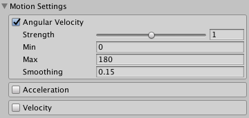
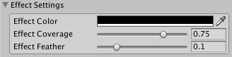
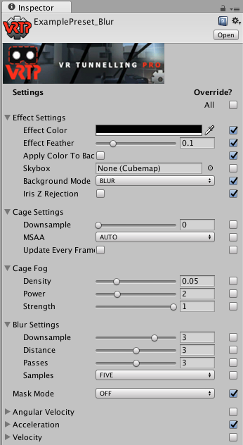
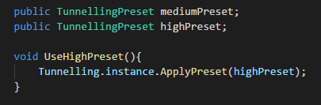
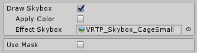
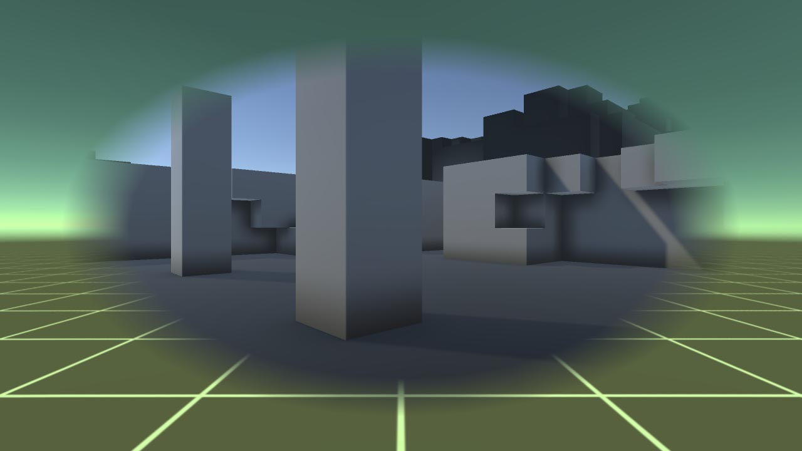
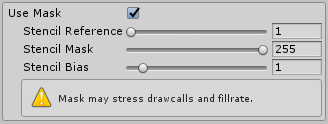
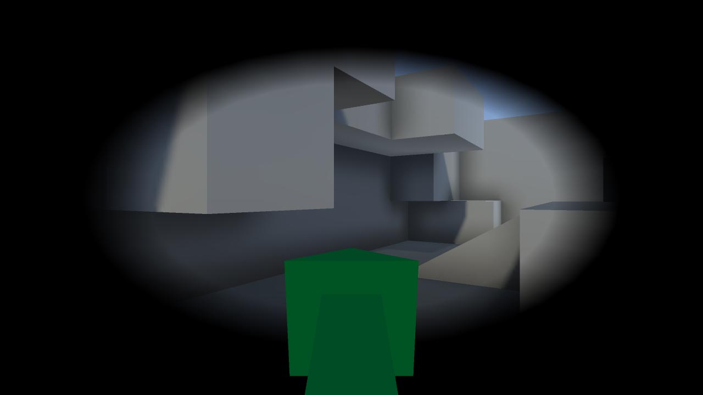
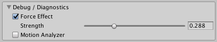
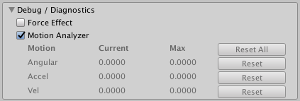

\page man Manual

The **Tunnelling** script<sup>\ref Sigtrap.VrTunnellingPro.Tunnelling "[API]"</sup> is the go-to variant for most projects. It works as a standard post-processing effect. To use, add to your camera object.

If your project needs the effect to ignore transparent and UI elements, use the **Tunnelling Opaque** script<sup>\ref Sigtrap.VrTunnellingPro.TunnellingOpaque "[API]"</sup>. This works identically to the **Tunnelling** script, except it only affects opaque objects. Transparent and UI elements are drawn after the effect.

> **TIP:** To change an existing **Tunnelling** effect to **Tunnelling Opaque**, switch the inspector to *Debug* mode, select the *Script* field on the **Tunnelling** component, and drag the **TunnellingOpaque** script in. All settings will be kept.

For mobile VR - or if you just need a higher-performance option - see the \ref mobile "Mobile" page.

## Topics
- \subpage motion
- \subpage effect
- \subpage bkg
- \subpage mask
- \subpage mfx
- \subpage presets
- \subpage scripting
- \subpage mobile
- \subpage debug
- \subpage techniques

\page motion Motion Settings
<div class="boxout">
    
    Motion settings
</div>
All effect variants use the same motion settings. Any combination of angular velocity (turn rate), acceleration and velocity can be used and tweaked.

All motion types can be toggled and have the following properties:<br>
**Strength** - How much does this motion type contribute to the effect?<br>
**Min** - Below this motion amount, no effect.<br>
**Max** - Above this motion amount, the effect is maxed out.<br>
**Smoothing** - Motion calculation will be smoothed out over this time.

### Angular Velocity
Drive the effect using turn rate. Angular velocity tends to create the most sim-sickness in users, so this is on by default.

### Acceleration
Drive the effect using acceleration. Changing speed and direction contributes to sim-sickness in many users, but less so than angular velocity.

### Velocity
Drive the effect using speed. Constant speed generally does not contribute heavily to sim-sickness, but can do in some users and in some situations. For example, this is more of a factor in first person games with no static reference frame (e.g. a cockpit or helmet) or directional cues.

> **TIP:** For help choosing appropriate motion settings, see the \ref debug "Debug Options" manual page.

\page effect Effect Settings
<div class="boxout">
    
    Effect settings
</div>
**Effect Color**, **Effect Coverage** and **Effect Feather** change the basic appearance of the vignette.

Depending on \ref bkg "Background Mode", **Effect Color** controls the color of the effect. Opacity is **always** determined by the alpha value.

> **TIP:** If alpha is less than 1, the **Iris Z Rejection** optimisation is disabled. See the \ref bkg "Background Modes manual page" for more details.

Coverage is how much of the screen is vignetted at maximum motion, and feather determines the fading on the inner edge.

These settings apply to all modes, although how they apply may differ slightly. Please see \ref bkg "Background Modes" and \ref mask "Masking" for how individual modes use them.

\page presets Presets
<div class="boxout">
    <div class="boxout-multi">
        
        A Tunnelling Preset
    </div>
    <div class="boxout-multi">
        
        Applying a preset in code
    </div>
</div>
Presets offer a quick, easy, data-driven way to change settings on the fly. These assets are created in the editor and applied at run-time using the \ref Sigtrap.VrTunnellingPro.TunnellingImageBase.ApplyPreset "ApplyPreset(TunnellingPreset p)" method.

By creating a number of presets, you can give your users the ability to easily change comfort settings through an options menu. Offering these options to users (including the option to disable tunnelling) is *strongly recommended* as different users respond to different solutions.

> **TIP:** Best practice is to offer users presets, but also allow them to change individual settings if desired. This lets users quickly find the right "ballpark" with presets, then tweak details.

## Creating Presets
To create a preset, right-click in the **Project** pane, and select:<br>
*Create > VR Tunnelling Pro > Tunnelling Preset*<br>
or<br>
*Create > VR Tunnelling Pro > Tunnelling Mobile Preset*.

This creates an asset you can edit. To reference in a script, make a field such as
`public TunnellingPreset myPreset`
and you can then drag the preset asset into the field in the editor.

> **TIP:** Both **Tunnelling** and **TunnellingOpaque** can use the same **TunnellingPreset** assets, but **TunnellingMobile** must use **TunnellingPresetMobile** assets.

## Editing Presets
Settings on a **Preset** asset match those on the **Tunnelling** script but are all shown at once regardless of modes. This can be overwhelming but allows full, detailed control for advanced users.

Additionally, each parameter has an associated tickbox in the **Override** column. *Only parameters with this ticked will be used*. All others are ignored - they retain whatever setting was active on the **Tunnelling** script at the time. Don't forget to tick override on the settings you want changed!

Ticking the **All** box makes all parameters active but won't overwrite the individual checkboxes - you can restore them just by unticking **All**.

> **TIP:** You can use selective overrides to make partial presets - for example, users can change motion settings separately from skybox settings.

\page scripting Scripting
Each variant automatically creates a singleton on Awake for easy code access:<br>
**Tunnelling.instance**<br>
**TunnellingOpaque.instance**<br>
**TunnellingMobile.instance**<br>

> **TIP:** All runtime code is contained in the **Sigtrap.VrTunnellingPro** namespace.

Almost all settings can be changed from code. However the simplest way to change settings is using the \ref presets "Presets" system.

For full details, please refer to the \ref Sigtrap.VrTunnellingPro "API reference".

\page mobile Mobile
Performance requirements for mobile VR are extremely tight, and as such fullscreen image effects are often undesirable. The **Tunnelling Mobile** script<sup>\ref Sigtrap.VrTunnellingPro.TunnellingMobile "[API]"</sup> provides the tunnelling effect at much higher performance without using post-processing. To use, add to your camera object.

To achieve this, basic color, skybox and mask modes are available but more advanced features such as 3D cages and blur are not.

> **TIP:** This effect uses the **Iris Z-Rejection** optimisation (see \ref bkg "Background Modes") automatically unless **Use Mask** is on.

## Effect Settings
<div class="boxout">
    
    Mobile effect settings
</div>
**Effect Color**, **Effect Coverage** and **Effect Feather** are the same as in the non-mobile effect variants - please see \ref effect "Effect Settings". However, the alpha component of **Effect Color** does not change the opacity of the effect.

To use a skybox in the vignette, tick **Draw Skybox** and select a cubemap for the **Effect Skybox**. Ticking **Apply Color** will tint the skybox using **Effect Color**.

## Masking
See \subpage mmmask "Mobile Masking" page.

## Motion Settings
These settings are shared with the non-mobile effect variants - please see \ref motion "Motion Settings".

## Platform Support
This version of the effect works on all supported platforms, mobile and non-mobile. It can work very well for desktop or console projects with a tight performance budget.

**Tunnelling Mobile** on non-mobile platforms supports single-pass stereo, as do **Tunnelling** and **Tunnelling Opaque**. However it does *not* support single-pass stereo on mobile platforms. These include GearVR, Cardboard and Daydream.

Furthermore, while VRTP *may* work with Vulkan on some mobile devices, this is not yet officially supported and in general may not work.

<div class="screenshot">
    
    Mobile tunnelling in **SKYBOX** mode.
</div>

\page mmmask Masking
<div class="boxout">
    
    Mobile masking settings
</div>
Simple masking is supported. This does not allow the \ref mwindow "WINDOW" or \ref mportal "PORTAL" modes present in the **Tunnelling** and **TunnellingOpaque** scripts, but allows objects to be excluded from the effect as in \ref mmask "MASK" mode. To enable, tick **Use Mask**.

> **TIP:** Masking works with or without **Draw Skybox**.

> **TIP:** Using masking disables the **Iris Z-Rejection** optimisation, and therefore may increase fillrate requirements. It will also increase drawcalls according to the number of objects being masked.

## Settings
Mobile masking uses the stencil buffer. Ensure that your project and hardware support this. 

- **Stencil Reference**: The effect will be excluded from pixels with this value in the stencil buffer. Masked objects will write this value to the stencil buffer.
- **Stencil Mask**: The mask used by the effect to read from the stencil buffer. Masked objects will use this as the write mask.
- **Stencil Bias**: Offset the z-value of masked objects to avoid z-fighting in the mask.

If you already use the stencil buffer, alter the **Stencil Reference** and/or **Stencil Mask** settings to avoid conflicts. If you encounter z-fighting in the mask, alter the **Stencil Bias** setting.

## Masking Objects
The simplest way to mask objects is to add a **TunnellingMaskObjectMobile** script<sup>\ref Sigtrap.VrTunnellingPro.TunnellingMaskObjectMobile "[API]"</sup> to any object to be masked. The object must have a **Renderer** component, such as a **MeshRenderer**. Ticking **Auto Add Children** will include child **Renderer** objects in the mask. Disabling the component or the gameobject will stop it being masked, and re-enabling will again add it to the mask.

Objects can also be masked from code using the \ref Sigtrap.VrTunnellingPro.TunnellingMobile.AddObjectToMask "AddObjectToMask (Renderer r, bool includeChildren)" and \ref Sigtrap.VrTunnellingPro.TunnellingMobile.RemoveObjectFromMask "RemoveObjectFromMask (Renderer r, bool includeChildren)" methods. Alternatively, just use `gameObject.AddComponent<TunnellingMaskObjectMobile>()`.

## Custom Shaders
You can also mask objects using custom shaders. To write a shader that masks the object being drawn, include the following Stencil block in your `Pass` or `Subshader`:

```
Stencil {
    Ref [_VRTP_Stencil_Ref]
    WriteMask [_VRTP_Stencil_Mask]
    Pass Replace
}
```

Objects with custom shaders such as this do *not* need to be added to the mask using either of the above methods.

The other two methods manually re-draw objects at the end of the frame, leading to increased drawcalls. Making shaders mask-compatible like this removes these extra drawcalls. 

Note also that the **Stencil Bias** setting doesn't affect this, as it's just to avoid z-fighting during re-drawing. If however you require this for whatever reason, add the following line to your `Pass` or `Subshader`:

```
Offset -1, [_VRTP_Stencil_Bias]
```
<br>
> **TIP:** If stencil objects are drawn before objects that occlude them, those pixels will be masked anyway. To avoid this, consider changing draw order or writing 0 to the stencil buffer on occluding objects.

<div class="screenshot">
    
    Mobile tunnelling with masking
</div>

\page debug Debug Options
<div class="boxout">
    <div class="boxout-multi">
        
        Force Effect
    </div>
    <div class="boxout-multi">
        
        Motion Analyzer mode shows current and peak motion to help tune motion settings
    </div>
</div>
All effect variants include *Debug* settings to aid in fine-tuning.

> **TIP:** These settings are only present in-editor and have no effect in builds.

## Force Effect
Toggling **Force Effect** and selecting a **Strength** manually controls the vignette without needing motion. This is useful to tweak effect settings.

## Motion Analyzer
Enabling the motion analyzer shows current and peak values for all three types of motion. This makes it easy to dial in minimum and maximum values appropriate for your project. The **Reset** buttons reset the **Peak** values to zero. The motion analyzer is greyed out unless in *Play* mode but can still be activated.

\page techniques Techniques
Tunnelling is a powerful VR comfort tool. But great VR requires lots of experimentation and tweaking. Comfort solutions vary wildly depending on what works in a given project, what suits that project, and what suits individual users. As such, the golden rules are:

- Make sim-sickness reduction part of the core of your project, not just added on top. This might mean more than just tunnelling.
- Give your users as many project-appropriate options as possible, with solid defaults.
- Be prepared to feel sick so your users don't have to.

That said, below are various tunnelling settings that can work well for particular project types. These are best used as starting points, as a good implementation will require fine-tuning and flexibility for users. It's also best not to limit yourself to these starting points, as you may find a completely unexpected way to improve your solution.

## Vehicles
Vehicles (cars, spaceships etc) have a major benefit - the cockpit. This gives users two things. Firstly, a static reference frame to ground them. Secondly, a clear indication of direction of motion. Users know that when they press "forward", they will move in the direction the vehicle points.

- **Motion Transform** should link to the vehicle itself.
- **Motion Settings**: At minimum, use **Angular Velocity**. Smooth, slow vehicle acceleration generally causes *more* sim-sickness than fast, abrupt acceleration; in this case using **Acceleration** may well help. In all cases, allowing users to turn on **Acceleration** and **Velocity** modes is recommended.
- **Background**: For many users, **COLOR** will be sufficient in vehicles. However **SKYBOX** or **CAGE** modes are a good default to provide a strong grounding effect.
- **Masking**: Using **MASK** mode and masking the cockpit is generally effective. This increases grounding by retaining more static objects while decreasing distraction by reducing visual change when the effect is active.

## First Person - Thumbstick Movement
First person games using thumbsticks/WASD to move are very challenging in terms of sim-sickness. Generally there is no static reference frame, and directional ambiguity. The two major causes of sim-sickness in this case is rotation, and not knowing the direction of movement.

Consider adding a clear visual indicator of the player's forward direction. For example, the green arrow in the *VRTP_Example* scene (although this is overly intrusive!). Specific implementation will depend on how direction is determined - for instance, do you use HMD direction, player object rotation, an average of both or something else?

- **Motion Transform** should be the player object.
- **Motion Settings**: Generally **Angular Velocity** and **Acceleration** should be used at minimum. Allow users to turn on **Velocity** mode as well if desired.
- **Background**: Usually **SKYBOX** or **CAGE** is a good default as **COLOR** may be insufficient for some players. Consider allowing **COLOR** and/or **BLUR** mode for players with higher sim-sickness tolerance.
- **Masking**: It can be useful to use **MASK** mode to mask objects attached to the player - for instance body and guns. Direction indicators should generally be masked. Some players will find that **WINDOW** mode provides a stronger grounding by adding the constant static reference that first person games usually lack - however this is usually too intrusive to be default. **PORTAL** mode can also be a useful option if portals are placed intelligently in the world.
- **Fake Cockpit**: If your experience would benefit from a fixed frame of reference, like a cockpit, but wouldn't make sense in-world, consider **CAGE_OVERLAY** mode to render a "fake" cockpit in the periphery.

## First Person - Wand-Directed Movement
Wand-directed movement is when the player moves in the direction they are pointing. In this case direction can be clearer, and generally there is no artificial rotation. Most of the guidelines for thumbstick motion apply, but there are some other considerations.

- **Motion Settings**: **Acceleration** is the most important mode here, but consider using **Velocity** for maximum effect.
- **Background**: While usually less intense than thumbstick, **SKYBOX** and **CAGE** are still good defaults for most players.
- **Masking**: See **Thumbstick Movement**. Masking the pointer object can be very important to maximise directional information.

## First Person - Physical Movement
This includes techniques such as running on the spot, arm-swinging and grab-and-pull locomotion. In these cases, direction is generally clear and physical motion can help many players. Most of the guidelines for wand-directed motion apply, but there are some other considerations.

- **Motion Settings**: See **Wand-Directed Movement**. Consider using **Velocity** by default as well, as for some techniques - especially grab-and-pull - motion happens in sharp bursts and this will help the effect respond well.
- **Background**: See **Wand-Directed Movement**. **BLUR** can again work well for less sensitive players, and can feel "right" with the kinds of motion involved.
- **Masking**: See **Wand-Directed Movement**. This depends heavily on project. For example, masking hands in arm-swinging and grab-and-pull can be effective, but a stronger grounding can be achieved with **WINDOW** mode. Consider using **WINDOW** mode with the provided *Window* mesh, and disabling the effect entirely when not moving. This can be particularly effective with grab-and-pull, making it very clear that the *world* is moving, not the player.

## Comfort Calibration
Where possible, we recommend implementing a dedicated "Comfort Calibration" mode in your project, so users can easily dial in their preferred settings for VRTP and/or other comfort solutions.

This should be a simple level where users can use the locomotion system while easily switching between comfort presets in-game, without returning to the menu. This allows quick comparison of settings and their effects.

It should be as easy as possible to toggle between presets. For example, remapping the primary/secondary fire buttons to next/previous preset, or placing physical buttons in-world to select presets.

## Multi-Camera Setups
VRTP works fine when a scene has multiple cameras - for instance used to switch between first-person and third-person views. However, the singleton instance references will only point to one of the cameras. As such, you must store instance references for each camera manually if interacting with the effect from code.

Additionally, the \ref Sigtrap.VrTunnellingPro.TunnellingMaskObject "TunnellingMaskObject" and \ref Sigtrap.VrTunnellingPro.TunnellingMaskObjectMobile "TunnellingMaskObjectMobile" scripts use the singleton references, and as such cannot be used. Use the \ref Sigtrap.VrTunnellingPro.Tunnelling.AddObjectToMask "AddObjectToMask()" and \ref Sigtrap.VrTunnellingPro.Tunnelling.RemoveObjectFromMask "RemoveObjectFromMask()" methods manually to manage masking.