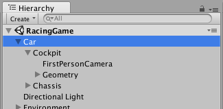
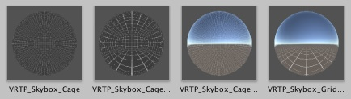

\page quickstart Quickstart Guide
Simply place the **Tunnelling** script on your camera, link up the **Motion Target** to the root object moving the camera, and the default settings are good to go.

    
    **Motion Target** should be the object controlling artificial 
    locomotion, not the camera

> **TIP:** **Motion Target** should be the object creating **artificial locomotion** to which the camera is attached. **Do not** link it to the camera's gameobject unless you have a specific purpose in mind. Doing so will drive the effect from the user's head motion, which is pointless as real head motion does not cause sim-sickness.  For example, in a first-person racing game, **Motion Target** should be the car.

## Example Scene
The *VRTP_Example* scene is a quick and easy way to test out the main features of VRTP. You can quickly cycle between basic, skybox, cage and masked modes while moving around, and see how these line up with settings on the **Tunnelling** component.

- Turn with the mouse or **[QE]**
- Move with **[WASD]**
- Cycle example presets with **[1-7]**
- Cycle example effect skyboxes with **[space]**
- Cycle example 3D cages with **[left control]**

To see a tour of these settings and more, watch the [intro tutorial video](TEST).

## Motion Settings

    

        
        Motion settings
    

    

        
        Included cage cubemaps (VrTunnellingPro/Prefabs/Skyboxes) 
        Note: By default these import at low res. For full quality, switch to 4096.
    

The default settings on the **Tunnelling** effect use the turning rate (angular velocity) of the **Motion Target** to drive a black vignette in the user's peripheral vision.

To also use acceleration and/or speed to drive the effect, tick **Acceleration** and/or **Velocity**. These motion modules have no effect by default - set the **Min** and **Max** values on each according to the motion present in your project.

Below the **Min** value of each, no effect will appear. Above the **Max** value, the effect will max out.

The **Smoothing** value smoothes out the motion calculation to prevent the effect flashing and stuttering.

## Effect Settings
Set the color, coverage and feather to change the appearance of the basic vignette. Coverage is how much of the screen is vignetted at maximum motion, and feather determines the fading on the inner edge.

To use a skybox for the vignette, change the **Background Mode** to **SKYBOX** and drag a cubemap texture into the **Effect Skybox** field. Various starter cubemaps are included in *VrTunnellingPro/Prefabs/Skyboxes*.

    
    Left: **COLOR** mode. Right: **SKYBOX** mode.

## Advanced Modes
For in-depth information, please refer to the \ref man "Manual" and \ref Sigtrap.VrTunnellingPro "API reference".